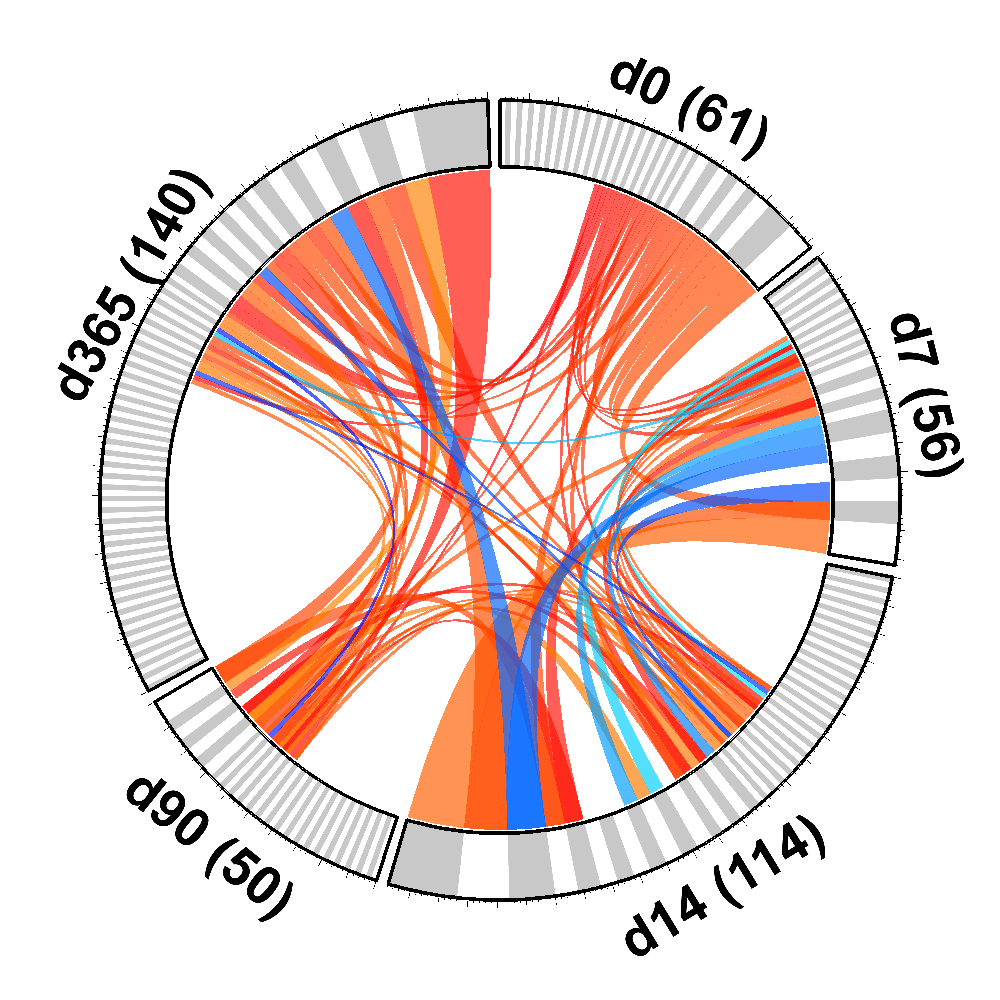

# Circos-Py
## Visualize Antibody Clones as Circos Plots

This script was made to convert spreadsheets of antibody clones into [Circos](http://circos.ca/) plots with different colors representing phenotypic characteristics of the antibody clones.

### Changes in the Circos Defaults

I've included my Circos configuration files which use fonts that are not included in the Circos Plot package.  Circos supports true type (.ttf) and open type (.otf) fonts, which can be added to the Circos package (fonts/modern/). To use an added font you must add a key term to the Circos fonts file (etc/fonts.conf) and the path to the font.  For example:  

`arial_bold = fonts/modern/Arial Bold.ttf`  

I'm also delimiting all my data files (karyotype and links) with tabs instead of spaces (the default).  This can be changed in housekeeping.conf file (etc/housekeeping.conf).

`file_delim = \t`

**ToDo:**
- Add example data
- Create py_circos module of functions
- Lock package dependencies
- Web GUI
